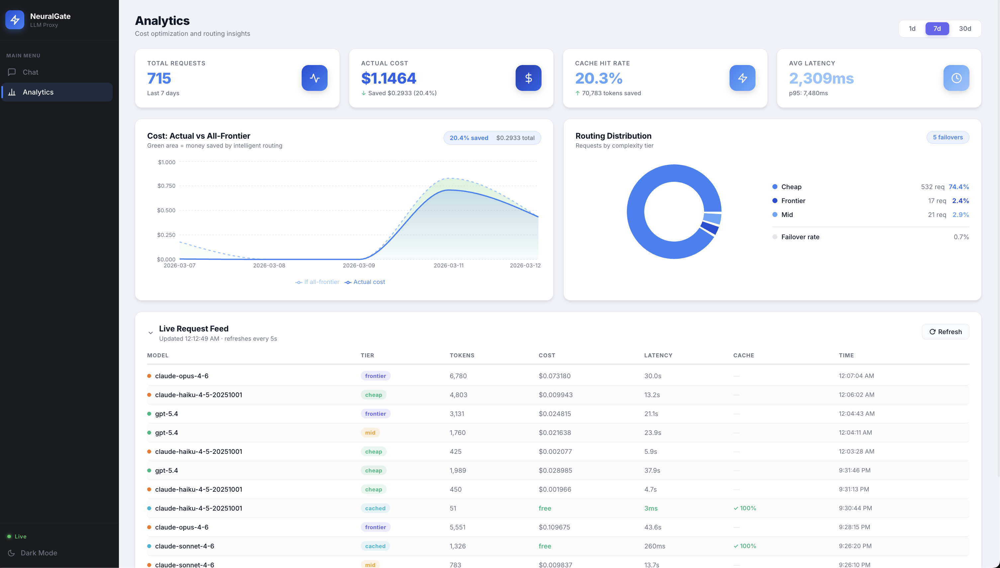
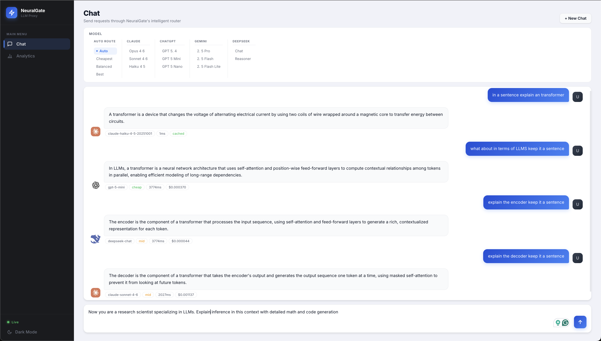
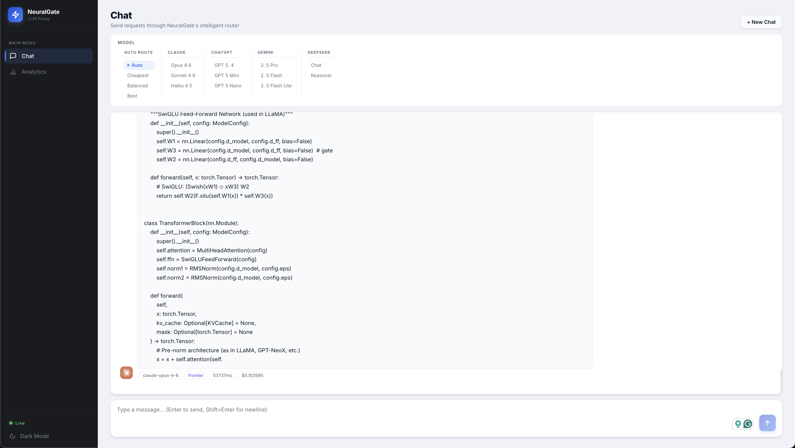

# NeuralGate

NeuralGate is a proxy layer that sits in front of every major LLM provider and automatically routes each request to the best model for the job — not the most expensive one. It classifies prompt complexity in real time and picks the cheapest model that can handle it well, so quality stays high while costs don't.

**Stack:** Python 3.11 · FastAPI · PostgreSQL 16 (pgvector) · Redis 7 · Docker Compose · React (Vite)

---

## Table of Contents

1. [Motivation](#motivation)
2. [How We Solve It](#how-we-solve-it)
3. [Dashboard](#dashboard)
4. [How NeuralGate Differs from Competitors](#how-neuralgate-differs-from-competitors)
5. [How It Works](#how-it-works)
6. [Model Registry](#model-registry)
7. [Complexity Classifier](#complexity-classifier)
8. [Two-Level Semantic Cache](#two-level-semantic-cache)
9. [Provider Failover](#provider-failover)
10. [API](#api)
11. [Rate Limiting](#rate-limiting)
12. [Setup](#setup)
13. [Design Tradeoffs](#design-tradeoffs)
14. [Architecture](#architecture)
15. [Future Improvements](#future-improvements)

---

## Motivation

LLMs are expensive — but not uniformly so. Claude Opus costs **5x more per token** than Claude Haiku. GPT-5.4 costs **50x more per token** than GPT-5 Nano. Most teams don't have time to build routing logic, so they pick one model and send everything to it — usually a frontier model, because no one wants to be blamed for a bad response. The result is massive overspend: paying top-tier prices for questions a cheap model could have answered just as well.

The uncomfortable truth is that the vast majority of LLM requests are simple. A user asking "what does this function do?" doesn't need the same model as a user asking for a nuanced architectural critique with step-by-step reasoning. If you can tell the difference before the request hits a provider, you can route accordingly — and save a significant amount of money without any perceptible quality loss.

That's the problem NeuralGate was built to solve.

---

## How We Solve It

NeuralGate sits between your application and every major LLM provider. Your code doesn't change — you just point your existing OpenAI SDK at the proxy and use `model="auto"`. From there, NeuralGate handles everything.

Every incoming request is scored for complexity before it reaches any provider. Simple requests — short questions, translations, quick lookups — are routed to fast, cheap models like Claude Haiku or GPT-5 Nano. Complex requests — multi-step reasoning, code critique, long-form analysis — are escalated to frontier models only when they're actually needed. If the same question has been asked before (or something semantically close to it), the cached answer is returned instantly at zero cost, no LLM call at all.

Across 7 days of real traffic: **715 requests routed**, **20.4% cost savings** vs all-frontier, **80% routing accuracy**, and **10ms** response time on cache hits vs ~2,300ms for live calls.

---

## Dashboard



The dashboard makes the core argument visually. **74.1% of all requests were classified as cheap-tier** — handled entirely by Claude Haiku or GPT-5 Nano at a fraction of the cost of frontier models. Only 2.4% of requests were complex enough to warrant a frontier model. This is the distribution you see in real-world traffic: most questions people ask are simple, and the reflex to route everything to the best model is costing teams money they don't need to spend.

The cache tells a similar story. A **20.3% cache hit rate** meant 78,763 tokens were never sent to any provider at all — returning in ~10ms instead of seconds, at zero cost. Repeated questions, paraphrased queries, and near-duplicate prompts all collapsed into single LLM calls. As traffic grows, the cache hit rate compounds: every new cached response absorbs all future variations of that question indefinitely.

---

## Chat

<table>
  <tr>
    <td width="50%"></td>
    <td width="50%"></td>
  </tr>
</table>

**Left — simple prompts, auto-routing, and multi-model conversation in a single thread.**
The first message ("in a sentence explain a transformer") returns a cached result instantly — zero cost, no LLM call. Switching to "what about in terms of LLMs" auto-routes to GPT-5 Mini, then DeepSeek handles the encoder question, then Sonnet picks up the decoder. Four different models, one coherent conversation — full chat history is passed on every request so each model has complete context regardless of which model came before. This also makes cross-verification natural: you can hard-set to GPT, ask the same question, then switch to DeepSeek and compare responses side by side in one thread. No separate sessions, no context loss.

**Right — complex task, automatic frontier escalation.**
When the conversation shifts to code generation ("explain inference with detailed math and code generation"), the classifier scores the prompt as frontier-tier and routes directly to Claude Opus 4.6 — automatically, without any manual override. The result is a full PyTorch transformer implementation. This is the routing doing exactly what it should: keeping cheap models on cheap work, and escalating only when the task genuinely demands it.

---

## How NeuralGate Differs from Competitors

| Product | What it is | Key difference from NeuralGate |
|---------|------------|-------------------------------|
| **LiteLLM** | Open-source LLM proxy with 100+ provider integrations | A translation layer — normalizes API formats but has no complexity classifier or automatic cost-based routing. You configure which model to use; it doesn't decide for you. |
| **OpenRouter** | Managed multi-model API with price-based routing | Routes by price floor, not by prompt complexity. The capability level is set by you per request, not inferred from the prompt itself. |
| **Portkey** | LLM gateway with observability and fallbacks | Strong on guardrails, caching, and observability. Routing is rule-based (failover if provider X fails), not complexity-aware. No automatic tier selection from prompt analysis. |
| **Martian** | AI router startup (YC W23) | The closest commercial equivalent — also classifies prompts and routes to the cheapest sufficient model. NeuralGate is the open, self-hosted, infrastructure-transparent version: every decision is logged, every weight is readable, no black-box API dependency. |
| **AWS Bedrock** | Managed multi-model API | An access layer, not a router. You choose the model per request. No complexity classification, no cross-provider failover, no automatic cost optimization. |

**What makes NeuralGate distinct:** The combination of automatic prompt complexity classification, two-level semantic caching, cross-provider failover, per-client rate limiting, and a full analytics dashboard — all in a single self-hosted proxy with zero vendor lock-in. Every request decision is logged and explainable. The `x_neuralgate` metadata on every response tells you exactly what tier was selected, what model ran, what it cost, and whether it hit cache. No other open-source proxy does all of this in one stack.

---

## How It Works

```
POST /v1/chat/completions
  1. Auth middleware (Bearer token)
  2. Rate limit middleware (Redis sliding window)
  3. Count tokens (tiktoken)
  4. Exact cache check (Redis SHA-256) → hit: return in <10ms, cost $0
  5. Semantic cache check (pgvector cosine similarity ≥ 0.95) → hit: return cached
  6. classify_complexity() → score 0.0–1.0 → tier (cheap / mid / frontier)
  7. select_model() → primary + failover chain
  8. Provider adapter translates OpenAI format → provider-specific format
  9. Call provider API with automatic failover on 429 / 5xx
  10. Normalize response → OpenAI format + x_neuralgate metadata
  11. Store to semantic cache + log to PostgreSQL (async, non-blocking)
  12. Return response
```

Cache hit path: ~10ms. Live LLM path: ~400–2,700ms depending on model and complexity.

---

## Model Registry

15+ models across 4 providers. Only providers with configured API keys are used — the router skips unavailable providers automatically.

| Tier | Default | Also available |
|------|---------|----------------|
| **cheap** | `claude-haiku-4-5` | `gpt-5-nano`, `gemini-2.5-flash` |
| **mid** | `claude-sonnet-4-6` | `gpt-5-mini`, `gemini-2.5-flash`, `deepseek-chat` |
| **frontier** | `claude-opus-4-6` | `gpt-5.4`, `gemini-2.5-pro`, `deepseek-reasoner` |

### Model Aliases

| Alias | Behavior |
|-------|----------|
| `auto` | Classifier decides tier, router picks cheapest available |
| `cheapest` | Always cheap tier |
| `balanced` | Always mid tier |
| `best` | Always frontier tier |
| `Opus 4.6`, `Haiku 4.5`, etc. | Force a specific model, bypass classifier |

---

## Complexity Classifier

Scores each prompt 0.0–1.0 using weighted heuristic signals. No ML model, no training data, runs in ~0.2ms.

| Signal | Effect |
|--------|--------|
| Prompt length | Short → lower, long → higher |
| Keywords: `analyze`, `critique`, `step by step`, `compare` | +0.10–0.20 |
| Keywords: `define`, `translate`, `list`, `what is` | −0.05–0.10 |
| Code blocks present | +0.15 |
| Multi-turn conversation depth | +0.10 |

**Score thresholds:** < 0.35 → cheap · 0.35–0.65 → mid · > 0.65 → frontier

---

## Two-Level Semantic Cache

**L1 — Exact match (Redis SHA-256):** Hashes the full messages array. Same prompt detected in < 1ms. Zero false positive rate. Handles repeated queries (health checks, cron jobs, identical user submissions).

**L2 — Semantic match (pgvector):** Embeds the prompt with `text-embedding-3-small` (1536 dims) and searches for any cached embedding with cosine similarity ≥ 0.95. Catches paraphrased equivalents — "What is the capital of France?" and "Which city is France's capital?" both hit the same cache entry.

The two-level design avoids embedding overhead on exact hits. Embedding calls only happen on L1 misses. Cache entries store the embedding, response text, and TTL (default 24h, overridable per-request with `X-Cache-TTL`).

---

## Provider Failover

Each model tier has a failover chain in the registry. On 429 (rate limit) or 5xx (server error), the router automatically tries the next provider in the chain. Client errors (4xx) propagate immediately without failover. Every failover is logged with `failover_occurred=true` and `original_model` for analytics.

```
Request → claude-opus-4-6 → 429
  → failover: gpt-5.4 → success
  → logged: {primary: "claude-opus-4-6", actual: "gpt-5.4", failover: true}
```

Failover rate over 7 days of production traffic: **0.7%**.

---

## API

### Core

| Method | Path | Description |
|--------|------|-------------|
| `POST` | `/v1/chat/completions` | Main proxy endpoint — OpenAI-compatible |
| `GET` | `/v1/models` | List all available models |

### Analytics

| Method | Path | Description |
|--------|------|-------------|
| `GET` | `/analytics/summary` | Total cost, tokens, request counts |
| `GET` | `/analytics/routing` | Tier breakdown and routing decisions |
| `GET` | `/analytics/savings` | Actual vs all-frontier cost comparison |
| `GET` | `/analytics/cache` | Cache hit rate and tokens saved |
| `GET` | `/analytics/recent` | Last N requests (used by LiveRequestFeed) |

### Operations

| Method | Path | Description |
|--------|------|-------------|
| `GET` | `/health` | DB + Redis connectivity status (no auth required) |
| `GET` | `/metrics` | Prometheus metrics |
| `GET/PUT` | `/rate-limits/{client_id}` | View/update per-client rate limits |

### Custom Request Headers

```
Authorization: Bearer <key>      # Required — PROXY_API_KEY
X-Client-ID: my-app              # Tag requests for cost attribution and rate limiting
X-Preferred-Provider: anthropic  # Prefer a specific provider
X-Max-Cost-USD: 0.01             # Reject models that would exceed this estimate
X-Force-Tier: mid                # Override classifier, force a specific tier
X-Skip-Cache: true               # Bypass semantic cache
X-Cache-TTL: 3600                # Cache TTL in seconds (default: 86400)
```

### Response Metadata

Every response includes an `x_neuralgate` field:

```json
{
  "x_neuralgate": {
    "selected_model": "claude-haiku-4-5-20251001",
    "complexity_tier": "cheap",
    "complexity_score": 0.21,
    "total_cost_usd": 0.000043,
    "total_latency_ms": 412,
    "cache_hit": false,
    "failover_occurred": false
  }
}
```

---

## Rate Limiting

Redis sliding window per client. Default limits:

| Window | Limit |
|--------|-------|
| Per minute | 60 requests |
| Per hour | 1,000 requests |
| Per day | 10,000 requests |

Overrides configurable per `client_id` via `PUT /rate-limits/{client_id}`. Exceeded limits return `429 Too Many Requests` with a `Retry-After` header. Sliding window (not fixed window) prevents boundary bursts.

---

## Setup

**Prerequisites:** Docker + Docker Compose · API keys for Anthropic and OpenAI (OpenAI key required for `text-embedding-3-small` semantic cache embeddings)

### 1. Clone and configure

```bash
git clone https://github.com/your-username/neuralgate.git
cd neuralgate
cp .env.example .env
```

Generate a key for `PROXY_API_KEY` — any random string works, but a long hex string is conventional:

```bash
openssl rand -hex 32 | sed 's/^/ng-/'
```

Open `.env` and fill in your keys:

```
PROXY_API_KEY=ng-your-secret-key-here    # required — all requests must include this as a Bearer token
ANTHROPIC_API_KEY=sk-ant-...
OPENAI_API_KEY=sk-proj-...              # also required for semantic cache embeddings
GOOGLE_API_KEY=AIzaSy...               # optional
DEEPSEEK_API_KEY=sk-...                # optional
```

### 2. Start

```bash
docker-compose up -d --build
```

The `--build` flag is only needed on first run (or after code changes) — Docker builds the proxy and dashboard images from the local Dockerfiles. Subsequent starts don't need it.

Once running, launch NeuralGate: http://localhost:3000

To stop all services:

```bash
docker-compose down
```

---

## Design Tradeoffs

**Heuristic classifier over trained ML classifier.** A fine-tuned DistilBERT would have higher accuracy than 80%, but requires thousands of labeled prompt-quality pairs before it's useful, model hosting overhead, and a cold-start problem. The heuristic runs in 0.2ms, is fully transparent (readable signal weights), and is good enough for routing where occasional misclassification has low cost. A trained classifier is the natural v2 once real usage data is available to label.

**Two-level cache over single cache layer.** Exact match handles repeated queries in < 1ms with no embedding overhead. Semantic match catches paraphrased equivalents but requires an embedding call (~100ms, $0.000001). Two levels: exact hits (dominant in production for health checks, cron jobs, re-submitted questions) are free; semantic search only runs on misses.

**Stateless proxy over stateful sessions.** Every request is independent. Horizontal scaling is trivial — any instance handles any request. Tradeoff: no session-level cost attribution or per-user routing preferences without a session layer above the proxy.

**OpenAI-format compatibility over native formats.** Clients never change their code regardless of which provider runs. Cost: adapter logic per provider, and provider-specific features (Anthropic extended thinking, Gemini grounding) require custom headers to expose. For a cost-optimization proxy, portability wins.

**Static bearer token over JWT.** The proxy consumer is an application configured once by a developer, not an end user logging in. JWTs add token expiry, refresh flows, and signing key management with no benefit in this context. `X-Client-ID` provides the attribution granularity needed for rate limiting and cost breakdown.

**Redis sliding window over fixed window rate limiting.** Fixed window allows boundary bursts: 60 requests at 12:00:59 and 60 at 12:01:01 = 120 requests in 2 seconds. Sliding window counts the last N seconds from now, eliminating burst attacks. Memory cost (sorted set per active client) is negligible at proxy scale.

---

## Architecture

```
proxy/
├── main.py               # FastAPI app, middleware registration, /health
├── classifier.py         # classify_complexity() — heuristic scorer
├── router.py             # select_model() — tier → model with failover
├── model_registry.py     # 15+ models, pricing, tier defaults, failover chains
├── cache.py              # Two-level cache: Redis exact + pgvector semantic
├── cost.py               # Token cost calculation
├── db.py                 # PostgreSQL connection + async logging
├── metrics.py            # Prometheus counters and histograms
├── settings.py           # Environment config
├── middleware/
│   ├── auth.py           # Bearer token check
│   └── rate_limit.py     # Redis sliding window per client
└── providers/
    ├── base.py           # BaseProvider ABC
    ├── anthropic_provider.py
    ├── openai_provider.py
    ├── google_provider.py
    └── deepseek_provider.py

dashboard/src/
├── pages/
│   ├── AnalyticsPage.tsx  # Cost, routing, savings, cache charts
│   └── ChatPage.tsx       # Live chat with model/tier metadata
└── components/
    ├── SavingsChart.tsx   # Actual vs all-frontier cost area chart
    ├── CostCards.tsx      # Summary stat cards
    └── LiveRequestFeed.tsx # Real-time request table

migrations/
└── 001_init.sql          # PostgreSQL schema (applied on first docker-compose up)
```

### Database Schema

| Table | Purpose |
|-------|---------|
| `requests` | Every proxy call: model, tier, tokens, cost, latency, cache_hit, failover |
| `semantic_cache` | Prompt embeddings (vector(1536)), cached response, TTL |
| `daily_analytics` | Materialized view: cost/tokens/requests by day/provider/model/tier |
| `rate_limit_config` | Per-client rate limit overrides |

`total_tokens` and `total_cost_usd` in `requests` are PostgreSQL `GENERATED ALWAYS AS` columns — no application-layer calculation drift.

---

## Future Improvements

**Markdown and code rendering in the Chat UI.** The current chat page renders all LLM output as plain text — code blocks appear as raw strings without syntax highlighting and markdown formatting is displayed literally. The fix is to pipe responses through a markdown renderer (`react-markdown` + `react-syntax-highlighter`) so code is presented in proper highlighted blocks and prose is formatted correctly. This would make the chat interface genuinely usable for development workflows.

**Domain-aware routing with a trained ML classifier.** The current heuristic classifier routes by complexity (cheap / mid / frontier), but a smarter system would also route by *domain*. Models have meaningfully different strengths: DeepSeek R1 excels at mathematical reasoning, Claude Sonnet is exceptionally strong for writing and nuanced analysis, GPT-5.4 leads on coding tasks, and Gemini 2.5 Pro has the longest reliable context window for document-heavy work. A trained classifier — fine-tuned on labeled prompt-response pairs with quality scores per model — could learn to route "implement a binary search tree" to the best coding model and "reconcile this balance sheet" to the best math/reasoning model, optimizing for *quality* within a cost tier rather than just picking the cheapest model in a tier. The proxy already logs every request; the training data builds itself over time.

**Chat history persistence.** The current chat interface is stateless — refreshing the page or starting a new session clears all conversation history. Persisting chat threads to the database (linked to a session or client ID) would let users pick up where they left off, review past routing decisions, and build a more complete picture of how NeuralGate handled their requests over time.

**Expanded model support.** The current registry covers Anthropic, OpenAI, Google, and DeepSeek. High-value additions include Meta's Llama models via Groq or Together AI (extremely low latency and cost, strong for the cheap tier), Cohere Command R+ (purpose-built for RAG and retrieval-heavy workloads), and Amazon Nova via Bedrock (volume discount pricing for enterprise workloads). Each new provider requires only a `BaseProvider` subclass and entries in the model registry — the routing and failover logic is fully provider-agnostic.
